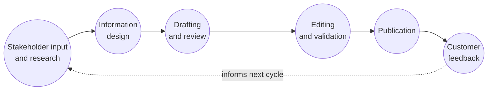

# How I design docs-as-code workflows

A working portfolio sample that shows how I structure documentation systems around contribution flow, review rules, publishing control, and long-term maintainability.

## Overview

A docs-as-code setup works best when contribution flow, ownership, review, and publishing are designed as one connected system instead of isolated tooling decisions.

### Core principle

I treat docs-as-code as an operating model, not just a repository pattern. The repository, branching strategy, review path, and publishing process must all support the people who maintain the documentation.

The goal is not simply to store docs in Git. The goal is to make documentation easier to update, review, reuse, and trust over time.

## Workflow components

Before choosing detailed tooling patterns, I define who can contribute, how changes are reviewed, and what the publishing rules are.

### Who can change content

Define whether documentation is owned by a central team, distributed across product teams, or maintained through a hybrid contribution model.

### How changes are approved

Clarify technical review, editorial review, and publication rules so contributors understand what done means.

### What reaches production

Separate draft, review, and release states to prevent incomplete or unvalidated content from being published accidentally.

## Draft to publish

A good docs-as-code flow reduces uncertainty for authors and makes review expectations visible from the start.

### Draft

Draft in a structured source file using agreed naming, headings, and content conventions.

### Review

Review for correctness, terminology, and task completeness before content moves forward.

### Publish

Publish through a controlled process that preserves consistency across the wider documentation set.

## Workflow map

This is the compact workflow I use to explain the operating model behind docs-as-code.

### Stakeholder input to publication

This flow captures real-world documentation work by including stakeholder input from developers, SMEs, and product owners, followed by review and validation before publication. After publication, customer feedback goes back into research and helps improve the next version.

## What I keep visible in the repo

Docs-as-code becomes easier to maintain when the repository itself communicates structure, ownership, and reusable patterns.

### Use predictable files and pages

- Keep titles and file names aligned.
- Use consistent section order across samples.
- Make the source easy to scan for contributors.

In this portfolio: Markdown source, generated HTML output, build script, and clear paths.

### Make ownership and review explicit

- Document who approves changes.
- Define what needs technical validation.
- Keep publishing steps lightweight but controlled.

In this portfolio: local-link validation and a GitHub Actions check on pull requests and changes to the published branch.

## Connected samples

This sample sits alongside tutorial and case-study pages that show how I build and maintain structured documentation.

### Customers API tutorial

A published tutorial that shows how I explain CRUD operations and structure task-based developer guidance.

[View tutorial](./customers-api-tutorial.html)

### Customers API source file

The Markdown source for the same tutorial. The build script turns this file into the published HTML page.

[View source](./content/tutorials/customers-api-tutorial.md)

### Portfolio source repository

The source files behind this portfolio, including its HTML structure, shared CSS, and published documentation samples.

[View portfolio source on GitHub](https://github.com/osza/myPortfolio)

## Docs-as-code as part of reliable documentation practice

This sample connects the published page with the workflow behind it: source files, review, ownership, and a structure that makes documentation easier to maintain.
